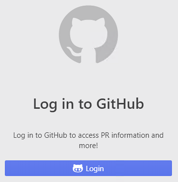
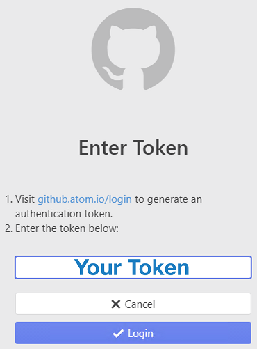
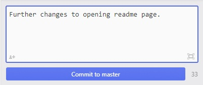
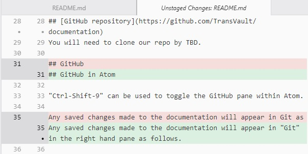

# Documentation
We use DocFX for our help and documentation side of things.

## Prerequisite

To get your documentation platform configured we use [chocolatey](https://chocolatey.org/) The package manager for Windows.

To install all prerequisites, open a command prompt as administrator and enter the following:

```
@"%SystemRoot%\System32\WindowsPowerShell\v1.0\powershell.exe" -NoProfile -InputFormat None -ExecutionPolicy Bypass -Command "iex ((New-Object System.Net.WebClient).DownloadString('https://chocolatey.org/install.ps1'))" && SET "PATH=%PATH%;%ALLUSERSPROFILE%\chocolatey\bin"
choco feature enable -n allowGlobalConfirmation
choco install docfx atom git
```

Close the command prompt and open a new one  as administrator again, this is needed to reload some environment variables. Now install some useful packages that will assist in the formatting of your documentation.

```
apm install tool-bar markdown-writer tool-bar-markdown-writer git-clone
```

## [DocFX](https://dotnet.github.io/docfx/)

To build the project, call the DocFX binary and point it to the repository ```docfx.json``` file and use the parameter ```--serve``` to spawn a web-service that listens on [http://localhost:8080](http://localhost:8080)

```
c:\docfx\docfx.exe c:\docs\docfx.json --serve
```

## [GitHub repository](https://github.com/TransVault/documentation)
You will need a GitHub account if you wish to contribute to our documentation library. If you do not have an account, you can sign up for a free one [here](https://github.com/join).

Once your account has been created you will need to advise Wayne of your loginID, so that you can be assigned the relevant permissions to the TransVault repository.

When permissions have been granted you will receive an email advising you have been invited  to collaborate on the TransVault/documentation repository.

You can clone our repo by opening the `Command Palette` "Ctrl+Shift+P" and type `git-clone` and press enter.
Enter `https://github.com/TransVault/documentation.git` into the `clone-from` field, and select a local path to save your temporary changes.

You will be prompted to enter your GitHub credentials so please enter them and CRACK ON!

## Markdown Preview
Pressing "Shift+Control+M" whilst in an existing document will bring up the markdown preview pane, so you can see how your document will look once it's published.

## Check in your changes in GitHub

Open a command prompt and add your GitHub details:

```
git config --global user.email "your.github@email.com"
git config --global user.name "github_username"
```

"Ctrl-Shift-9" can be used to toggle the GitHub pane within Atom.

@Mike please review and update = try pushing first

Select the GitHub icon 

Select the Login button 

You will be redirected to [https://github.atom.io/login](https://github.atom.io/login) copy the token

Enter the token and sleect Login 


Any saved changes made to the documentation will appear in "Git" in the right hand pane as follows.


To stage your changes you can either select "Stage All" or right click a file and select "Stage"

Once selected your staged files will appear as below:


To commit your changes enter a simple "commit message" noting what changes have been made, then press `Commit to Master`



The final step is to  your changes into the repository. When doing this for the first time, you will be prompted to enter your GitHub userID and password.

When any changes have been committed do remember to check the live [GitHub](https://github.com/TransVault/documentation "GitHub") page to confirm everything is ok.

### Reviewing your Changes

If you select one of the `Unstaged Changes` in the Git pane, it will bring up a new window like the following:



Lines in Red are rows deleted, those in green are additions to the file.

### Pulling changes from GitHub

If changes have been made by other users to the live repository, the push button will be replaced with .  Pressing this will upload your local copy with the updated files.
