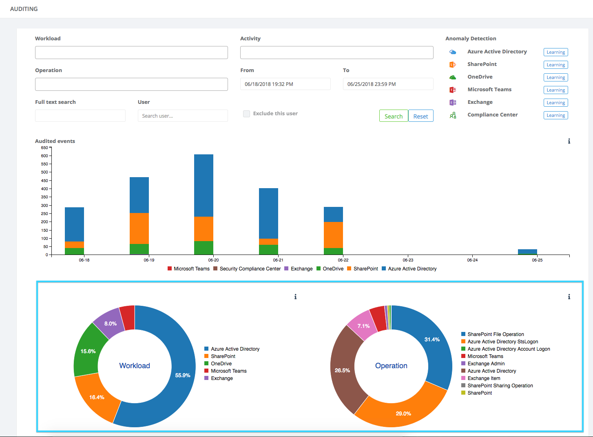

# Main screen
Below is a screenshot showing the main auditing screen:

The page is divided into a number of sections as described below.

# Query area
The query area is where you build queries to search your audited events:

There are many attributes of each audit event, we've tried to categorize and group things to help you make the best use of the information. We've split the query into:
* **Workload**
	This is the available workload, such as Exchange, OneDrive for Business, etc.
* **Activity**
	This is a specific activity such as logging into a mailbox, or creating a team in Microsoft Teams
* **Operation**
	This is an individual operation group. It comes in to play when reviewing audited events relating to things like OneDrive, because they may in the background use other workloads (for example SharePoint)
* **Date from, and date to**
	A date and time range can be input or selected from a date/time picker.
* **Full Text search**
	This allows you to search for specific terms in the query results.
* **User**
	If you're interested in the audit events associated with a specific user that user can be selected here.
* **Exclude user checkbox**
	This flips the query to exclude the user that has been selected in the query. In orders it will show every other user, except the one you have chosen.

# Anomaly detection
This area of the main screen, shown below, indicates the state of the anomaly detection learning. 

# Audited events over a period of time
The chart in the center of the screen, shown below, shows information about the number of captured events per day, over the last 7 days:

# Breakdown of captured audit events to date
At the bottom of the main auditing screen are two charts which show a break down of the audited events captured to date. This gives an indication of the relative amounts of events captured per workload.

**Note**: Not all audit events from Microsoft capture a location. In time it is hoped the range of events showing location information will increase, but this is reliant on Microsoft.
