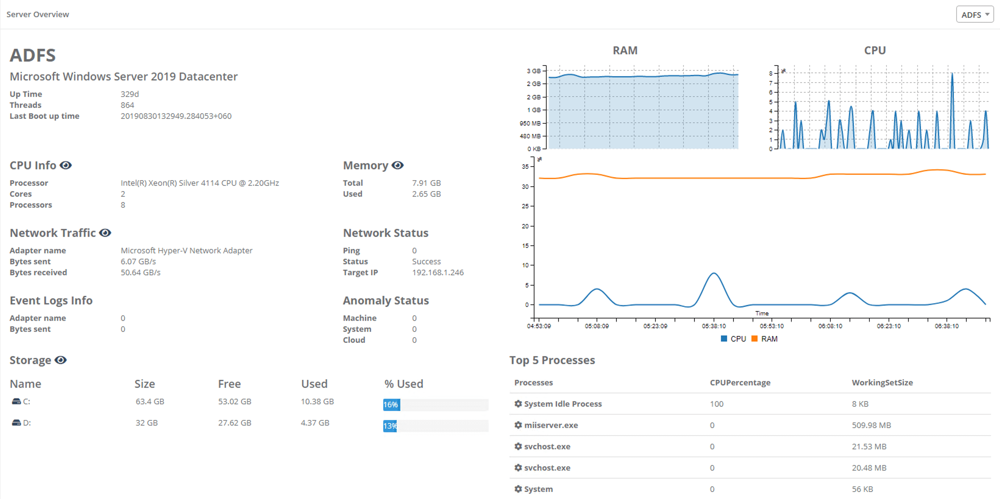
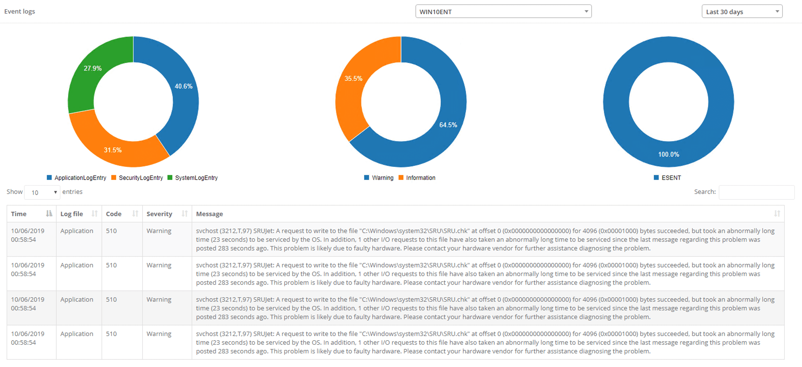
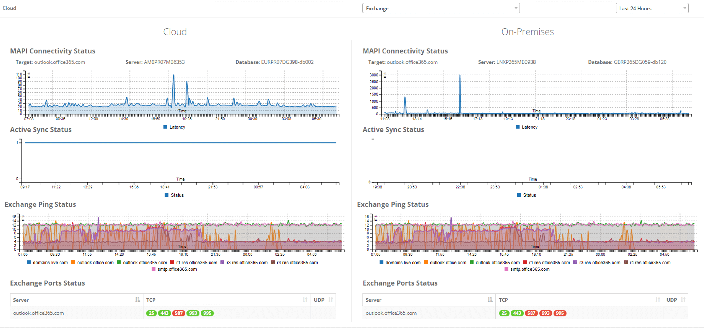

# Welcome

You are now reviewing the documentation for our monitoring component.

Our aim with this documentation is to give you an overview of what you can see inside the application,
along with examples of how to find out specific things relating to your environment. We've based these examples on information that some of our customers have provided, and asked us about whilst developing the product!

# Getting started

After you have completed the configuration by using our getting started wizard we can begin capturing monitoring events from the specified servers.  This data is then stored securely in our system and made available for you to perform queries against to discover valuable information relating to usage and operations being performed in your Office 365 tenant.

For further information on using the monitoring module, review the menu on the left.

# Overview

To navigate to the `Overview` page, select the `Monitoring` link from the navigation bar on the left, and selecting the `Overview` tab.

The overview page will allow you to view what agents you currently have installed and organised by if they are installed on-premises or if they are in the cloud.

Monitoring will actively manage and check the status for each server, if you have multiple instances of the same server on-premises, (e.g. 2x Exchange Servers) they will be displayed within their respective server. You will be able to click on the respective server option to be either navigated to the `Server` page for on-premises installations, or the `Cloud` page for cloud installations.

# Server

To navigate to the `Server` page, select the `Monitoring` link from the navigation bar on the left, and selecting the `Server` tab at the top.

When viewing the page, you are able to see key information about the server, including the type of Central Processing Unit (CPU) and network adaptors, and how many processors and cores have been assigned.

You are also able to view key statistics about how the server is being utilised, ranging from RAM and CPU utilisation, to storage and the top five processes the server is currently executing.

 

For further information you can select the `eye` buttons against the key information to display a graph of its utilisation within a set timeframe.

# Process

To navigate to the `Process` page, select the `Monitoring` link from the navigation bar on the left, and selecting the `Process` tab at the top.

You will be able to view what processes are currently being utilized by the server, the ID associated with those processes, and the working set size and thread counts.

 

Additionally, there are graphs that will allow you to view a historical representation of thread counts, CPU utilisation and the working set size.

# Event Logs

To navigate to the `Eventlog` page, select the `Monitoring` link from the navigation bar on the left, and selecting the `Eventlog` tab at the top.

You will be able to view a donut chart of key event logs that have occurred over your selected server, and the percentage of each type of log, ranging from informational logs to warnings.

 

# Anomalies

To navigate to the `Anomalies` page, select the `Monitoring` link from the navigation bar on the left, and selecting the `Anomalies` tab at the top.

TransVault uses specialised Machine Learning algorithms to assist their users with identifying anomalies within a user's data.  You will be able to view the anomalies by selecting the relevant on-premises, or cloud servers.

 

# Cloud

To navigate to the `Cloud` page, select the `Monitoring` link from the navigation bar on the left, and selecting the `Cloud` tab at the top.

You will be able to view and compare key statistics about your cloud and on-premises server installations over a set timeframe, such as the MAPI connectivity status and its latency, the Active Sync status, and if it was active or inactive.

Additionally the Exchange ping status that will provide the ping of each server against key domains, such as outlook.office365.com.

Finally you can also review which TCP or UDP ports are currently being utilised

 
