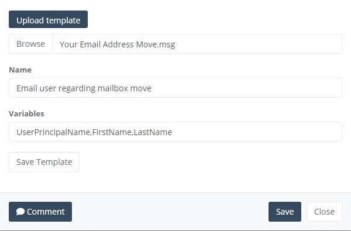

# Email Templates

## Utilising email templates

Using email templates as part of your workflow is a great way of keeping users informed and updated on the progress for their respective mailboxes.  Below are more details around this feature.

## Creating a new Mail User Template

You must first create a new MSG file using an email client like Outlook.  It is possible to add in specific variables so you can tailor the email sent out to the users. This takes the form of ||FieldName|| e.g.

**||UserPrincipalName||**

or

**||FirstName|| ||LastName||**

Drag one of the “Communication Steps” mail options onto the canvas, click the cog icon.

Select “Upload Template” and browse to where you have stored your template MSG file.

Give the template an appropriate name.

Note – you must ensure you enter the same variables in the relevant section as those you are using in your template email file, but separated by a comma.

e.g. UserPrincipalName,FirstName,LastName

Once completed click Save Template. If the template is saved ok you will see the following:

**Note** – To be able to select your new template against a Mail communication step you must close the workflow editor and re-launch it.

## Using an Existing Mail User Template

On the workflow pallette, Click the cog icon on your Mail User step.

If you are choosing a previously created Template select the appropriate one from the drop down list.

Select Save to complete this step.
