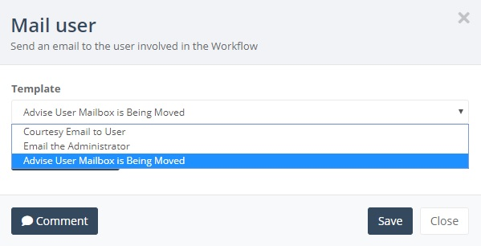
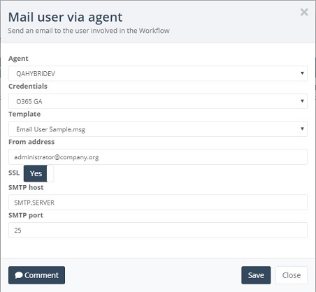

# Email Templates

## Utilising email templates

Using email templates as part of your workflow is a great way of keeping users informed and updated on the progress for their respective mailboxes.  Below are more details around this feature.

## Creating a new Mail User Template

You must first create a new MSG file using an email client like Outlook.  It is possible to add in specific variables so you can tailor the email sent out to the users. This takes the form of ||FieldName|| e.g.

**||UserPrincipalName||**

or

**||FirstName|| ||LastName||**

**Note** - If you are using either the "Mail User" or "Mail Administrator" steps for your email template, be aware that there is a 120KB .MSG file size limit.  Email templates used for the "Mail user via agent" step are not impacted in this way, as these will be sent via the specified SMTP server in the workflow step.

Drag either the "Mail User" or "Mail Administrator" communication step mail options onto the canvas, click the cog icon.

Select “Upload Template” and browse to where you have stored your template MSG file.

Give the template an appropriate name.

Note – you must ensure you enter the same variables in the relevant section as those you are using in your template email file, but separated by a comma.

e.g. UserPrincipalName,FirstName,LastName

Once completed click Save Template. If the template is saved ok you will see the following:

**Note** – To be able to select your new template against a Mail communication step you must close the workflow editor and re-launch it.

## Using an Existing Mail User Template

On the workflow palette, Click the cog icon on your Mail User step.

If you are selecting a previously created Template choose the appropriate one from the drop down list.

Select Save to complete this step.

## Mail user via Agent

This step was created specifically for those projects where you want to avoid the 120KB file size limit, or are simply looking to route the emails via a specific on-premises Exchange server.  All required template files need to be copied into a folder called “EmailTemplates” as a subfolder of where the OnBoard Agent is installed e.g. D:\Agent\EmailTemplates

**Note** - If you add more template files you must restart the OnBoard Agent to ensure they are picked up.

**Agent** - Specify the agent you want to process the request.

**Credentials** - Specify the account you want to process the request.  This must have sufficient permissions to send emails via the specified SMTP server.

**Template** - Select the required template from the dropdown list.

**From Address** - Specify the "From Address" you want the emails to show as having come from e.g administrator@yourcompany.organisation

**SSL** - Select Yes/No depending on whether SSL is required

**SMTP Server** - The name of the SMTP server the emails are going to be sent via.

**SMTP Port** - 25 or 465

Once you have configured the required settings you can select Save.
