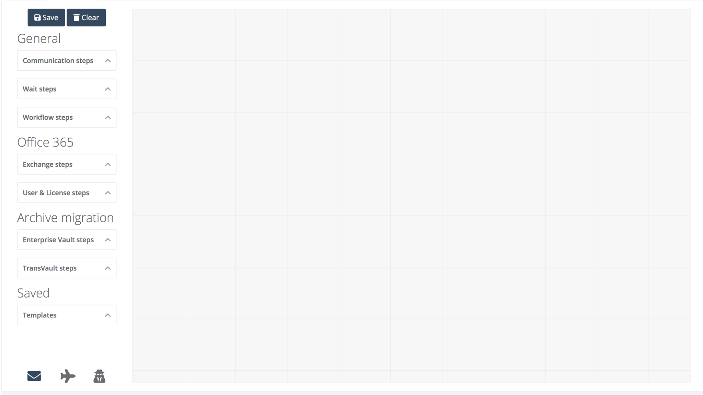
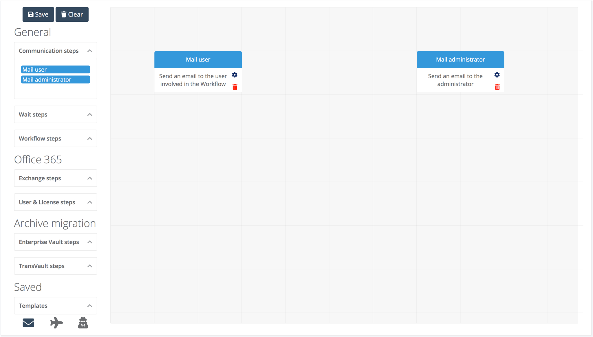
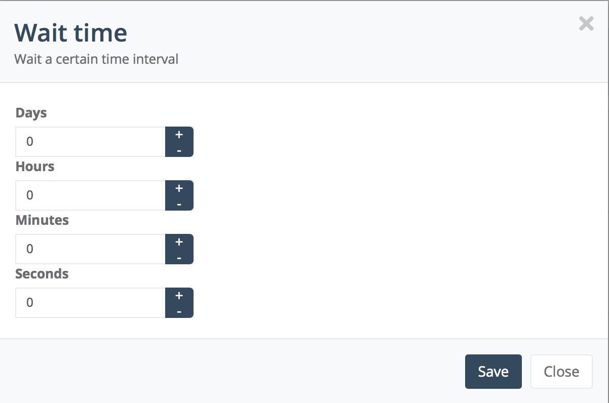

# OnBoard

## Getting started

There are three stages to go through to get started with ACS Onboarding, and they're described in the sections below:

### Agents and configuration

At least one agent has to be deployed to a on-premise server in order to use the onboarding features. Don't worry though, it's really easy to setup and configure. The instructions are covered in this [section](newindex.md#deploying-an-agent).

### Creating a workflow

After the agent is properly configured the next step is to create a workflow. The instructions are covered in this [section](newindex.md#creating-a-workflow).

### Mapping the first user

The final step in using Onboarding is to map a test (or pilot) user. The instructions are covered in this [section](newindex.md#mapping-a-pilot-user).

## Deploying an agent

The following steps describe how to deploy and authorize an agent.  All of these steps take place on the 'Agents' tab inside the Onboarding application.

**Note**: If an agent is deployed, but not authorized it will not be used by Onboarding.

### Generate a Key

The first step to deploying an agent is to generate a unique key for the installation. This is valid for 2 hours, and should be copied to your clipboard for use during the agent installation.

### Download the agent

The latest agent can be obtained and should be downloaded to the server where it is going to be installed.

### Install the agent

During the installation you can specify the location where the agent is installed on the local machine. You must also provide the key which was generated inside the Onboarding application.

**Note**: If the key is more than 2 hours old, it will not work and a new one will need to be generated.

### Configure credentials

Depending on the role of the agent additional credentials need to be input. This activity is performed with the credentials manager. The name of these credentials (but not the credentials themselves) will be visible in the Onboarding interface allowing you to process different workflow steps under different credentials.

<screenshot needed>

### Authorize the agent

Once the agent has successfully started it will check-in with the Onboarding application. On the 'Agents' tab in the user interface you will be able to see the freshly installed agent. To allow the agent to be used for Onboarding select it in the table, and click the icon in the 'Authorized' column. A few seconds later the agent will be authorized for usage by Onboarding.

### Add plugins

Depending on the role of the agent additional agent-side plugins can be added to the agent. These will be automatically downloaded and the functionality will be added to the agent which has been selected.

## Creating a Workflow

A workflow is an essential element of onboarding. It consists of a number of workflow steps which will be executed in order to process a user or a group of users.

The workflow template system is flexible and can be used to create simple and complex workflows to suit the particular onboarding requirements. In order to get started, we'll go through an example of creating a simple workflow to send out emails to a user and an administrator.

All of the workflow template activities take place on the Workflows tab and are described below.

### The Canvas

The main workflow template editor window looks like this:

In here you can retrieve previously saved templates, as well as configure new ones.  You begin by dragging and dropping workflow steps on to the canvas. You can arrange them however you like, but we prefer to see them put into a logical order to make following the workflow eaier.

## Communication steps

In this simple example we will expand the 'Communication steps' group of workflow steps and drag and drop two communication steps. These are shown below:

### Introducing a delay

For our example we want to introduce a few minutes delay between the email steps. This is achieved by dragging and dropping a 'Wait steps' workflow step. We now have a template like this:

### Joining the steps

The steps in a workflow need to be joined together to show the logical flow of the process. That's easy to do. Click and drag from the text of one workflow step, to the next in the sequence. Repeat that process for each step, and you will see this:

### Configuring the steps

Some of the steps have configuration options available to them. That's shown by the small cog-icon on the workflow step when it's on the canvas. If you click that it will show a pop-up and allow you to configure the steps.

For our example on the user communication step, we can configure a template email to send to the user. Similarly in the administration communication step we can configure a template to send, and we can configure who the email will go to. Lets choose your own email address for that.  Lastly, our wait step allows us to configure how long we want to wait.  Lets choose 5 minutes for that step.

### Finally, saving the workflow

The final step is to save the workflow template. We can give the template a friendly name which will help us when it comes to mapping users.  

**Note**: If there is a problem with the workflow a pop-up will appear giving your advice on how to fix it.

# Moving a mailbox to Office 365

**Coming Soon** We describe a very simple workflow template for moving a mailbox from on-premises to Office 365, in this section.

## Mapping a pilot user

The process of assigning a workflow to a user is called mapping. This step can be done on individual users, or hundreds of users! Lets see how to perform a mapping of one test user in the following section.

This process takes place on the Mappings tab in the user interface.

### Finding a user

The mappings page shows a list of your on-premises users. You can use the search box to quickly locate the user you wish to process.  Once you've located the user. Select the checkbox next to that user, and click on the 'Map' button above the data grid.

**Note**: You can not map an already mapped user.

### Mapping the user

The process of mapping a user is simple. You can give this chosen batch a name - that's useful for tracking purposes. You pick a workflow template, and a priority and you can even add a comment for the batch which will help later if someone has questions around the users in the batch.

### What happens now?

The mappings page will reflect the selections and mapping you have created. In the background our onboarding application will perform all the necessary steps in your chosen workflow, and the user interface on the mapping and batches page will be updated to show the current status.

### Batching

Processing one user as we've done here is useful if you want to test the process of onboarding with your chosen workflow. Once the testing is done you will want to begin processing your user population in batches. That's covered in this [section](batching.md).

## Batching

Batching is an important step in onboarding lots of users. We've added the ability to the Onboarding application to setup batches manually, as well as being able to pick, use and customize automatically created batches based on groups.

All of this takes place on the Batches tab in the application, and is described below.

### List of batches

The top of the batches tab shows you batches that have already been created. Here you can perform operations on those batches such as enabling or disabling them from migration. You can also see the priority of the batch, how many users are in the batch,  whether the batch has already finished onboarding and much more!

### Selecting a batch

If a batch is selected in the top data table, then the bottom of the screen shows more details about users which are in that batch including the workflow that they are assigned and the status.

### Groups lead to batches

We've added some predefined templates to help with creating batches. These are based on Active Directory properties. Groups can also be created manually. We've made it super flexible to even pick some people from a particular group and create a batch of just those users!

### Monitoring progress

There are three places that the progress of a mapping and of the overall onboarding project can be seen. These are described below.

### Overview

This tab gives an overall view of the progress of the migration.

**More needed**

### Batches

This tab gives summary information relating to batches that have been processed in the onboarding project, as well as some details about individual users within a batch.

### Mappings

The mappings tab gives details about individual users who have been processed. If a user is selcted you can quickly see the individual steps that have been performed!

